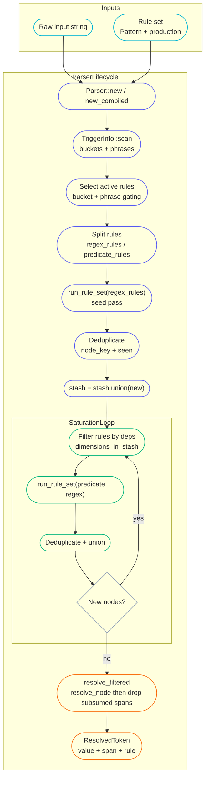

# astorion

Duckling-style parsing engine in Rust.

[](#)
[](#)
[](#)
[](LICENSE)
[](#)

## What is it?

Astorion is a Rust port of Duckling’s rule-based entity parsing pipeline.

## Who is it for / why does it exist?

- Teams that want Duckling-like time/numeral parsing but prefer a Rust codebase.
- Contributors who want an engine + rule architecture that’s easy to extend with new dimensions/locales.
- Anyone experimenting with saturation-style parsing (discover nodes → combine them → resolve).

## Quick start

```bash
cargo run -- "from 2:30 - 5:50"
RUSTLING_DEBUG_RULES=1 cargo run -- "tomorrow at 5pm"
cargo run -- --reference 2013-02-12T04:30:00 "tomorrow at 5pm"
```

## Example usage

Run the built-in CLI (prints a saturation summary + resolved tokens):

```bash
cargo run -- "tomorrow at 5pm"
```

Or build a release binary:

```bash
cargo build --release
./target/release/astorion "from 2:30 - 5:50"
```

## Status & guarantees

- **Status:** alpha.
- **Stability:** a minimal public API is stabilized; see "Public API" below.
- **MSRV:** 1.85.0 (see `rust-version` in `Cargo.toml`).
- **Breaking changes:** allowed at any time while `0.x`.

## Roadmap

- Define a small stable public API (e.g. `parse(...) -> Vec<Entity>`).
- Improve parity with Duckling semantics (resolution, span/ranking behavior).
- Add locale scaffolding and additional dimensions.
- Add CI, docs, and (eventually) publish a crate.

## Public API

Astorion now exposes a deliberately small, stable API surface intended for early adopters:

- `parse(text) -> ParseResult`
- `parse_with(text, &Context, &Options) -> ParseResult`
- `Context`, `Options`, `Entity`, and `ParseResult`

These items are re-exported at the crate root (`crate::time_expr::parse`, `crate::time_expr::ParseResult`, etc.).
All other modules, types, and debug/verbose entry points are considered internal and may change
without notice while the crate is in `0.x`.

## Contributing

See `CONTRIBUTING.md`.

## Release process

See `docs/release-process.md` and `CHANGELOG.md` for versioning and release guidance.

## License

MIT. See `LICENSE`.

---

## Features

- Duckling-style rule engine: regex/predicate patterns, production closures, saturation to a fixed point.
- Span-based results with rule provenance (`rule_name`) and an evidence chain.
- Built-in CLI debug report (saturation passes, tokens, timings).

## Installation

Astorion is not published to crates.io yet.

To use it locally as a dependency, add a path dependency:

```toml
[dependencies]
astorion = { path = "../astorion" }
```

## CLI usage

The CLI is the primary interface and ships with usage, flags, and exit codes:

```bash
cargo run -- --help
```

### Options

| Option                    | Description                                                                                        |
| ------------------------- | -------------------------------------------------------------------------------------------------- |
| `-i, --input <text>`      | Input text to parse. If omitted, Astorion reads remaining args or stdin when no args are provided. |
| `--reference <timestamp>` | Reference time in `YYYY-MM-DDTHH:MM:SS` (default: `2013-02-12T04:30:00`).                          |
| `--color`                 | Force ANSI color output.                                                                           |
| `--no-color`              | Disable ANSI color output.                                                                         |
| `-h, --help`              | Show help text.                                                                                    |
| `-V, --version`           | Print version information.                                                                         |

### Exit codes

| Code | Meaning                             |
| ---- | ----------------------------------- |
| `0`  | Success.                            |
| `1`  | Internal error.                     |
| `2`  | Invalid arguments or missing input. |

Set `RUSTLING_DEBUG_RULES=1` to print rule filtering/production diagnostics.

## How it works

At a high level, the engine repeatedly applies rules to grow a stash of `Node`s, then resolves and filters the results.



Key implementation touchpoints:

- `Parser::new_compiled` performs trigger scanning and rule activation.
- `Parser::saturate` runs an initial regex pass, then loops predicate-first until a fixed point.
- `Parser::node_key` + `seen` prevent unbounded growth from duplicate nodes.
- `Parser::resolve_filtered` resolves nodes, sorts by dimension/span, and drops spans contained by a wider match.

## Contributing

See `CONTRIBUTING.md`.

## License

MIT. See `LICENSE`.
